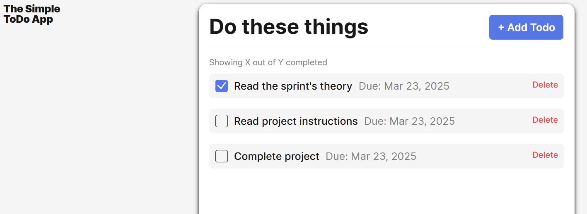
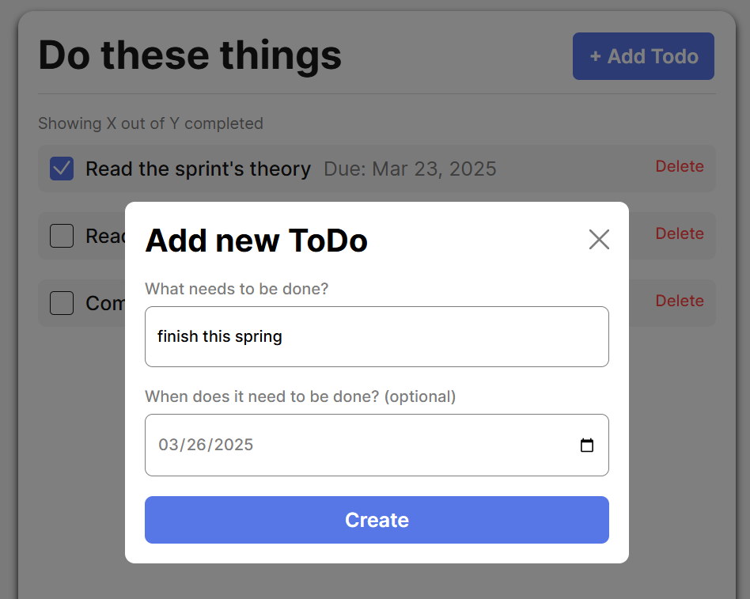
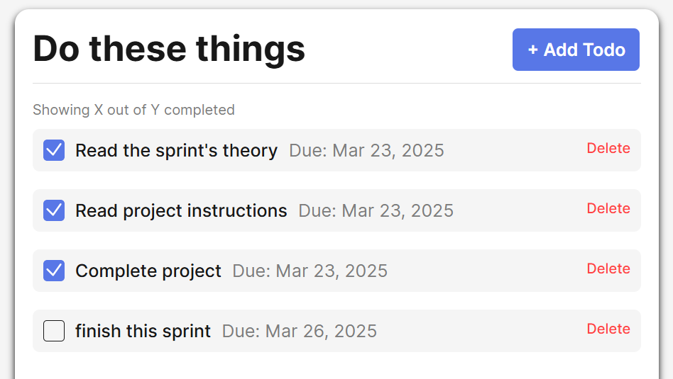

# Simple Todo App

This project is a simple "to-do" list application with various features. 

## Functionality

This application has a modal that opens to enter new tasks and a completion date. There is also a delete option to remove tasks from the app as well. You can click on an item in the to-do list to complete out the task. There is validation setup to make sure the dates entered are current and for future dates. 

## Technology

Some of the technology used in this application is mainly JavaScript, but includes CSS, and HTML. The JavaScript uses validations, refactoring the existing JavaScript, updating the projects file structure, and creating JavaScript classes.

Please see some image examples of the to-do list below:

## Deployment

This project is deployed on GitHub Pages:

- [Deployment Link] (https://koukla516.github.io/se_project_todo-app/index.html)